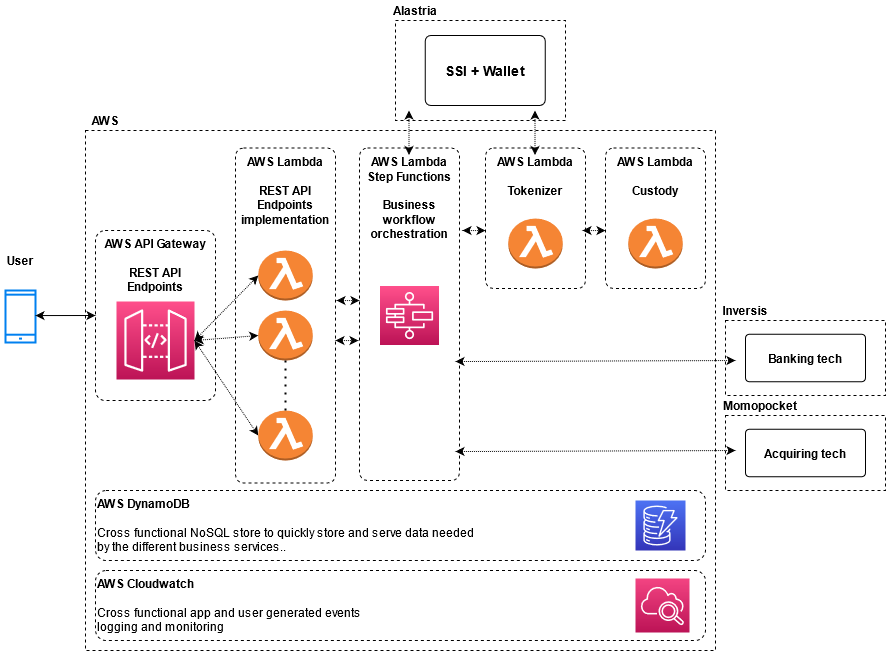

# IO Builders assignment - Money Tokenizer PoC

## Table of contents

- [Introduction](#introduction)
- [Architecture and tech stack](#architecture-and-tech-stack)
- [Project management methodology](#project-management-methodology)
- [Team](#team)
- [Costs](#costs)
- [Risks](#risks)
- [Culture](#culture)

# Introduction
The purpose of this document is to define and analyze the scope, architecture, tech stack, risks, costs and team sizing to build a proof-of-concept money tokenizer on top of the Ethereum blockchain.

Moreover, we'll analyze the culture and human values that a company created to develop, maintain and commercialize the money tokenizer itself should have.

The main actor is a mobile user (using either iOS or Android) that should be able to perform the following operations:
- Create an identity on the blockchain by using an existing self-sovereign identity implementation.
- Use the Ethereum wallet to:
    - Pass KYC verification.
    - Deposit fiat money via IBAN.
    - Deposit fiat money via credit card.
    - Withdraw fiat money.
    - Transfer tokens to another wallet.
    - Receive tokens from another wallet.
- Convert fiat money into tokens and viceversa by using the money tokenizer.

All user transactions should be stored and monitored to comply with existing regulations.

The PoC should be ready in no more than four months: the architecture, tech stack and team should be chosen and sized according this restriction. 

## Out of scope
The money tokenizer needs to consume external services whose analysis is outside of the scope of the PoC:
- A Self Sovereign Identity (SSI) implementation, provided by Alastria.
- An Ethereum wallet, also provided by Alastria.
- The banking tech platform, provided by Inversis.
- The Acquirement platform, provided by Momopocket.
- An e-money license in order to operate with the banking system.

Even though these items are provided by third parties, the relationship and integration between the money tokenizer and each one of them will be analyzed below. 

## Limitations and assumptions
At the time of writing, the integration interfaces provided by Inversis and Momopocket are unknown. In order to provide a sensible analysis of the money tokenizer system, I will assume both of them provide access to their services through the means of a generic web services (SOAP or REST API).

# Architecture and tech stack

Given the strict time constraints of the project, I propose to use an event-oriented and completely serverless architecture built on top of services provided by a public cloud provider.

This would bring the following benefits: 
- Let the team focus on the development of the business workflow and added value tasks, reducing to a minimun the burden of handling the required underlying infrastructure. 
- No need to deploy and provision new physical hardware on-premises: this is usually a costly and time consuming task, that might take up to 3/4 weeks, which is unacceptable for a four months project. On the contrary, hardware resources deployment on a cloud provider might take only a few hours, or even just minutes in a serverless managed architecture.
- Pay only for the resources effectively used to serve an user-initiated transaction, with no costs of unused resources whatsoever.
- Immediate release of resources once they are no longer required.
- Automatic up/down scalability of application resources to accomodate increase/decrease in application traffic once the product is potentially released to the public.
- Effortless storage, tracking and monitoring of application logs and/or user-generated events to comply with existing data governance regulations.
- Promotes decoupling and reuse of services, thus increasing modularity and reusability of modules across different company's products.

In the architecture proposed in the next chapters I use services provided by Amazon Web Services; Other public cloud provider could be used as well since most of them offer very similar solutions. The solution is not tied to any Cloud vendor *a priori*.

According to the above, the proposed architecture can be pictured as follows: 

- The mobile phone app interacts with a layer of REST APIs exposed through *AWS API Gateway*[1].  API Gateway is a fully managed service that simplifies how developers create, publish, maintain, monitor, secure and scale APIs. APIs act as the front door for applications to access data, business logic, or functionality from backend services.
- API Gateway routes each API call to an *AWS Lambda*[2] implementor. AWS Lambda is a serveless compute service that lets developers run their code without provisioning nor maintaining servers, automatically handling scaling logic based on the actual traffic. Lambda supports different code runtimes, among others: python, NodeJS and the JVM.
- Each API call logic executed on a Lambda instance *might* trigger a complex workflow. Lambda, per se, is not well suited to handle such complex logic. To solve this issue I propose the use of *AWS Step Functions*[3], which are a low code, visual workflow service that enables developers creating complex business workflows involving the interaction of many different services. In our money tokenizer, the business workflow might involve coordinating the access to external services such as the ones provided by Inversis, Momopocket or Alastria, but also coordinating the actions of the tokenizer itself or the custody service.
- Both the tokenizer and the custody service are implemented by using one or more Lambda instances:
    - The tokenizer is responsible of issuing new tokens to the Ethereum blockchain and communicates with Alastria's SSI and wallet through the means of *Alastria's Identity Lib[4]*.
    - The custody service is responsible of keeping track of the fiat funds transferred in or out the system by each customer. This service might also be responsible of keeping track of other business metrics, such as the global amount of funds handled by the system, for example. 

Two additional cross functional services are needed:
- A low latency NoSQL datastore, providing storage service to all the above elements. The datastore proposed is DynamoDB[5]. This is a completely managed NoSQL databse that automatically scales up or down depending on the actual traffic coming from the different applications.
- AWS Cloudwatch[6], a service tool to handle, monitor and audit all application and service logs as well as user generated events. 

Optionally, application logs and service data can be dumped to an external filesystem to be exploited in advanced data analytics pipelines. 

## Tech stack

### Development language

I propose to base all PoC's code on Javascript/Typescript and NodeJS. The rationale behind this decision is the following:

- On the mobile app side of things, one of the requirements is to have an excellent UX. At a more technical level this means we need to develop native apps for both platforms: mobile apps developed using HTML5+CSS are well known to yield a poor UX[7]. 
Since we also have the additional constraint that both apps need to be ready in less than four months, we need to use a cross platform development framework, since we cannot assume the costs of separately developing native apps for each mobile platform. Given these constraints, the only possible available options are Microsoft Xamarin (open source, using .NET for app development) and React Native (open source, using Javascript for app development). As it comes clear in the next sections, developing on .NET would result alien in the context of this project. Thus, our only option here would be to use *React Native*.
- Among the different runtimes supported by AWS Lambda, the NodeJS runtime has been benchmarked to have very low cold start times and low memory consumption [8][9]. This not only brings low latency and a better overall user experience, but will also help reducing operational costs, as analyzed in the <a href="#costs">costs sections</a> below. 
- Alastria's *alastria-identity-lib*: this library will be used to interact with Alastria's SSI implementation and has been developed in TypeScript and can be immediately consumed in Javascript/Typescript applications such as our money tokenizer.
- The language *Solidity* will be used to implement Smart Contracts for the Ethereum platform. Solidity has been designed around the ECAMScript syntax to make it familiar for existing web developers. Solidity has static typing and should be very easy to pickup, especially for Typescript developers.

Standardizing the tech stack on a single development language helps reducing the time to build the development team: Javascript is among the top 10 most popular development languages according to the 2021 Tiobe Index[10]. Also, code standardization helps knowledge sharing of the different software components among different members of the team and reducing the complexity of code reviews (all participants will be able to immediately understand the code). 

This will, in turn, increase the overall resiliency and quality of the final product. 

### Code and quality management

Atlassian offers an interesting cloud package for small teams, allowing the increase of teams sizes with time at very low prices. 

- *JIRA*[11]: to manage the agile workflow, keep track of new features, their status as well as tracking issues and product defects. 
- *Bitbucket*[12]: in addition to the git cloud repository, Bitbucket offers integrated CI/CD pipelines, deployment environments and seamlessly intergates with JIRA to link git commits/branches/releases to issues.

In addition to these two tools, I propose the use of *JFrog Artifactory*[13] to publish and manage the lifecycle of the software artifacts produced by the development team. This lowers the barrier to reusing internal libraries and artifacts across different projects. 

# Project management methodology

I would propose the use of an agile methodology to manage the project lifecycle. Agile reduces production cycle time and allows for failing fast and fast recovery once something goes wrong.

The Scrum agile methodology rationalizes the different roles of the members of the team and helps organizing work in iterative chunks of 2/3 weeks called Sprints. 

Each Sprint has its own deliverables, previously agreed upon at sprint preparation time by the Product Owner (the project promoter, the person having the most accurate understanding of how the product should be and should work) and the team itself, leaded by a Scrum Master. 

A Scrum master is a facilitator and is responsible of removing any possible hindrance the team might encounter along the way.

Sprint preparation involves almost all the stakeholders involved in the project and since Sprints have a short duration, it is advisable to keep sprint preparation meeting short and focused (4-5 hours), in order for the sprint preparation meeting not to eat a too big percentage of the sprint duration itself. 

The project should have a Sprint 0, in which the product backlog is worked out between the PO and the SM and where an initial functional analysis document is delivered. The scope of the funcional document at this stage is just to analyze the tech work that should be done on the following sprint.

This structure is repeated at each sprint. The functional document is enriched with the analysis of the tech work that should be delivered in the next sprint.

# Team

This PoC involves different professionals with different skills and different professional background. The following sizing is the minimum viable team composition to get the PoC ready in four months:

- 1 Product Owner. As described in the previous paragraph, the PO is a senior professional acting as the project promoter and should have a clear understanding of how the product should work at a functional level. A product owner is not usually dedicated full time to a single project, but can share his/her time with other ventures and might even be external to the organization.

- 1 Scrum master: this professional should act as the project leader on the team side. He/she should have good communication skills to be able to interact with the PO and other stakeholders but also a strong technical background in order to fully understand the problems that might arise and help solving them.

- 1 Dev Ops with previous experience in the AWS cloud. Having experience with AWS Cloudformation to deploy infrastructure as code is valuable.

- 1 React Native developer to develop the iOS and Android mobile apps.

- 1 Javascript/NodeJS developer, needed to implement the REST API and business workflow.

- 1 Javascript/Typescript developer to develop the money tokenizer itself, the smart contracts interacting with the Ethereum blockchain and to integrate with Alastria's services. Having previous experience with Solidity is valuable.

# Costs

This section will not give any precise monetary cost estimation to build but rather will present the pricing model for each one of the services proposed in the architecture above and how the pricing model fits into the PoC. 

Also, analyzing the costs related to hiring the team goes beyond the scope of this document and won't be discussed. 

At technical level, the proposed architecture depends on the following external cloud services:

1. AWS API Gateway: there are no minimum fees or upfront payments, users only pay for what they use, i.e. the amount of REST API calls and the amount data transferred out of the cloud environment. AWS API provides a free tier of one million REST API calls *per month* during the first year of usage of the service. 

2. AWS Lambda: this services charges for the number of executions of a specific Lambda function and the duration of the execution of the lambda itself (rounded to the millisecond). Duration pricing is also a function of the amount of computer resources needed (cpu time and amount of memory required), thus it's especially important developing for a low resource consumption runtime like NodeJS. AWS Lambda offers a free tier of 1million free requests and 400.000 GB-seconds of compute time *per month* (forever).

3. AWS Step functions: this service charges for the number of state transitions in the workflow across all used state machines. The service offers a free tier of 4000 free state transitions *per month*.

4. AWS DynamoDB: this service charges for the amount of data stored and the amount of reads and writes that applications performs on DB tables. DynamoDB pricing is more difficult to estimate since depending on the type of workload estimated, DynamoDB might offer different operating modes that might result economically more convenient. In general, the service offers a 25GB storage free tier, which should be sufficient to handle the amount of data needed for this PoC. A small price fee might have to be paid to accomodate the number of reads (0.25$ per million reads) and the number of writes (1.25$ per million writes).

5. AWS Cloudwatch: this service offers free basic monitoring metrics for all AWS services (which should suffice for the scope of this project). Also, the first 5GB of logs data are included in the free tier and each additional GB of data is charged 0.5$ per month. Setting an adequate log rotation policy should be enough to garantee PoC's log data does not exceed the free tier maximum.

6. Atlassian JIRA: Atlassian provides free access to their JIRA offerings for teams of up to 10 users. Since the estimated size of the team is 6 people, the free tier should suffice.

7. Atlassian Bitbucket: Atlassian provides a free tier to small teams of up to 5 users. Even tough our team is comprised of 6 people, only 4 of them are really technical and needs to access to the code repository to carry our her job. Thus, the free tier should be enough for the duration of the PoC.

8. JFrog Artifactory: JFrog offers a free tier for an unlimited number of users but limited to the amount of data trasferred to and stored inside the artifact repository. The limits are 10GB transfers per month and 2GB of artifact storage, which should be enough for the scope of the PoC.

According to these pricing models, the free tier of each one of these cloud services should give plenty of room to develop the PoC in a very cost-effective way (or at no cost whatsoever).

# Risks

We can identify two different sets of risks: business and technical risks.

*Business risks*: before starting such endeavor, company management should try to clarify who is the target audience for the product. Depending on the target audience, getting a sensible market share might be difficult since in the Blockchain ecosystem there are already well established competitors offering the same product at mass scale.

*Technical risks*:
- Everything blockchain-related is relatively new and it's difficult to find profesionals having this specific set of skills. Hiring people without this knowledge might pose the PoC at risk, due to the very strict time constraints and the steep learning curve.
- The tech team might also need a rump up period to get used to work in a serverless environment.
- The product depends on external providers that should be aware of the importance of this product for the company. As any other stakeholder, these providers should commit at delivering high quality technical documentation and technical support when needed.

# Culture

One of the most difficult tasks for a company is building and maintaining a bi-directional trust relationship with employees. 

Building and maintainign such trust relationship is instrumental to retain talent: human resources are hard to acquire and very easily lost. Maximizing tenure of employees should be an high priority goal for a company, along with other technical and business goals.

On this topic, the key question company management should ask themselves is: "how do I retain talent?". 
The following action items have been proven effective to reach this goal and make employee feel valued and intellectually stimulated:

- Give credit to his/her good work, let other people inside the company know about the achievements or work delivered by the individual.
- Make people feel their compensation package is competitive in the market and that will keep being so if goal are met on a regular basis.
- Do periodic (at least annual) performance reviews. A performance review might be the opportunity for a position or salary raise.
- Set and periodically review (every six months) goals for each employee. Goals should be challenging but feasible, to avoid deteriorating employees emotional state.
- Promote constant learning by economically supporting training programs that are relevant to the business.
- Incentivize knowledge sharing across the company by the use of different means. Reward those who do it on a regular basis (this doesn't necessarily have to be a monetary reward, a gamification system might be just as effective if correctly implemented).
- Incentivize research by letting people dedicate part of their work week to experiment with new ideas. 

A *behavioral framework* is also very effective at setting a common way of working across the company, regardless of the specific task, responbility or role each person covers. 

A behavioral framework is a set of principles, moral tenets or values that all people inside a company should follow. These norms seldomly change with time and should constantly be exercised. Once correctly implemented, a behavioral framework defines a common way of approacing problems that benefits the company as a whole. These are some of the properties that a good set of company principles should have:

- Act as a North Star and guide for people in moments of uncertanity and lack of definition.
- Promote collaboration over competition.
- Promote showing professional respect to fellow colleagues and managers.
- Promote knowledge sharing.
- Promote effeciency by reducing wastes of different resources as much as possible.
- Help people have big aspirations and being proactive at promoting and driving initiatives. 

Behavioral frameworks have been instrumental to the success of companies like Microsoft[14] or Amazon[15]; having a similar set of values might help a company define an healty work environment and grow organically.

# External references

[1] [AWS API Gateway](https://aws.amazon.com/api-gateway/)

[2] [AWS Lambda](https://aws.amazon.com/lambda/)

[3] [AWS Step functions](https://aws.amazon.com/step-functions/)

[4] [https://github.com/alastria/alastria-identity-lib](https://github.com/alastria/alastria-identity-lib)

[5] [AWS DynamoDB](https://aws.amazon.com/dynamodb/)

[6] [AWS Cloudwatch](https://aws.amazon.com/cloudwatch/)

[7] [Zuckerberg: betting on HTML 5 for Facebook mobile app was a mistake](https://www.engadget.com/2012-09-11-zuckerberg-html-5-facebook-mobile-app-mistake.html?guccounter=1&guce_referrer=aHR0cHM6Ly9kdWNrZHVja2dvLmNvbS8&guce_referrer_sig=AQAAAH_TnHJNrIMZqFhPIbr4LF7da6kN_pYp7ci7evRr6ROPrIAT9q7TvtWmrgo90G31DZQ_vZ3jFpeRGS4V_7vGX4isO6XXljdD4d6Qc6YWkerF2pW0Mu90cYZ_XjXsK3iV3Q43XTAWsMHOVWvmmpZwGZdwA7gtGpKk1TUBufMz9cp6)

[8] [Benchmarking AWS Lambda runtimes in 2019 (part I)](https://medium.com/the-theam-journey/benchmarking-aws-lambda-runtimes-in-2019-part-i-b1ee459a293d)

[9] [Benchmarking AWS Lambda runtimes in 2019 (part II)](https://medium.com/the-theam-journey/benchmarking-aws-lambda-runtimes-in-2019-part-ii-50e796d3d11b)

[10] [TIOBE Index for August 2021](https://www.tiobe.com/tiobe-index/)

[11] [JIRA Cloud](https://www.atlassian.com/software/jira)

[12] [Bitbucket cloud](https://www.atlassian.com/software/bitbucket)

[13] [JFrog Artifactory](https://jfrog.com/artifactory/cloud-automation/)

[14] [6 Words That Have Transformed Leadership at Microsoft](https://neuroleadership.com/your-brain-at-work/microsoft-leadership-principles)

[15] [Amazon's leadership principles](https://www.aboutamazon.com/about-us/leadership-principles)