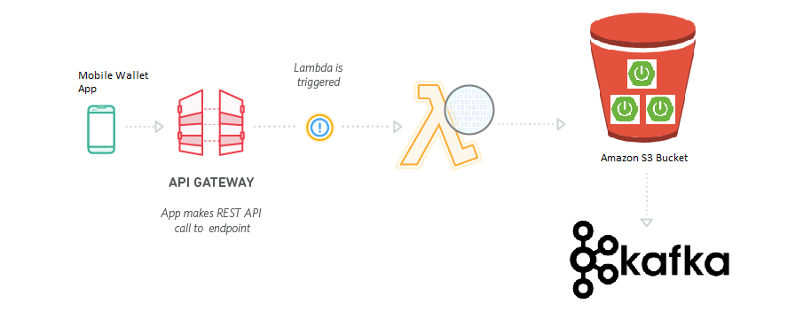

## Tech + Architecture
#### Frontend
Real android and ios app with React Native or Nativescript.

HTML5

CSS3

SaaS
#### Backend

Java 9

Maven

Serverless architecture with Amazon API Gateway and AWS Lambda functions.

Microservice arquitecture with Spring Boot 2. Following microservices design patterns.

Spring 5

Asynchronous microservices

Apache kafka

RESTful JSON APIs

Security is extremely important. Security in Amazon API Gateway with AWS Identity and Access Management (IAM) and Amazon Cognito.

ACID-compliant and transactional relational database PostgreSQL.

Audit and tracing is very important too. AWS cloud trail

SonarQube for code quality. Team decides rules.

Jira for project and tasks management.

Bitbucket or Gitlab.

Slack for internal team communication.
## Team
Project Leader. No scrum master.

2 Frontend members.

2 Backend microservices members.

2 blockchain/ethereum experts.

Fullstack profiles required.

No tester in the team. Team makes unit and functional testing.
## Culture
Agile mind. Kanban methodology.

Mandatory to make unit tests for every microservice layer.

Gitflow workflow.

KISS principle.

Follow RESTful principles and community best practices.

API first. Frontend and backend teams must work together to define APIs.

Best practices and code styles guides.

Functional programming.

Code reviews through pull requests. 

Document everything. Swagger/OpenAPI for REST APIs.

Code based on interfaces.

No TDD or BDD.

Pair programming.

