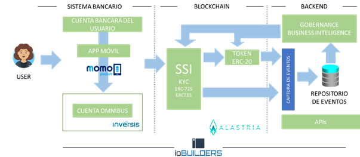
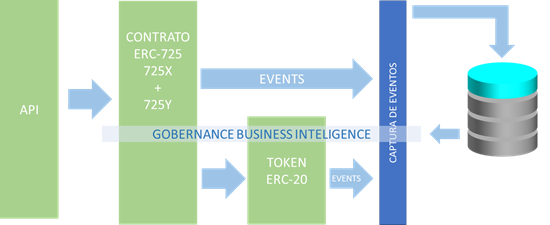

# iobuilders

# INTRODUCCIÓN

Se establece la necesidad de crear un sistema que permita al usuario de forma sencilla y segura, intercambiar dinero FIAT por tokens alojados en un contrato inteligente. El sistema debe cumplir con los estándares de seguridad y de regulación. Esto requiere un esfuerzo que trasciende el ámbito tecnológico y que tiene complejas implicaciones legales.
Sucintamente podemos describir el proceso a nivel usuario de la siguiente manera:

El usuario a través de aplicaciones usables debe ser capaz de:
- Transforma dinero en tokens para su uso posterior en otros servicios / soluciones (compras, transferencias de tokens…). Esto debe poder realizarse mediante las operaciones bancarias estándar: transferencias, pago con tarjeta de crédito, etcétera.
- Retirar el dinero en forma de tokens y transformarlo en dinero FIAT en la cuenta bancaria del usuario

Es necesario por parte de IOBuilders mantener una cuenta con la contraparte de todos los tokens emitidos. Para ello se destinará una cuenta ómnibus que almacenará todos los fondos FIAT de los usuarios. Esta cuenta únicamente almacenará los fondos, pero no dispondrá de información concreta sobre los fondos de todos los usuarios pues esta información será almacenada en el contrato de token. 
Dado que el cumplimento de la regulación es un requisito indispensable, se establecerán medidas de control de acceso a los usuarios y de identidad digital. Se plantea que el certificador último de la identidad de los usuarios pueda ser una entidad de confianza o bien la propia IOBUilders.
Llegados a este punto merece la pena destacar que la transparencia es vital en una solución como la que se está describiendo. En este sentido, sería muy conveniente que una entidad certificadora certificara que todos los tokens están respaldados por fondos en la cuenta omnibusa así como la certificación de los propios cntratos. La solución planteada no dista mucho de que es una clásica stablecoin.
Queda fuera del este análisis establecer los “tokenomics”, es decir si se va a acuñar nuevos tokens o estos se van a quemar en ciertas circunstancias. Tampoco se hace mención a la posibilidad de establecer una comisión por transferencia de token dentro del contrato que permita ampliar los modelos de negocio de la solución.

# ARQUITECTURA

Sucintamente podemos describir la arquitectura del sistema de la siguiente forma:

## ENTORNO BANCARIO
Tiene como objetivo transferir fondos de los usuarios hacia la cuenta ómnibus y viceversa. La gestión de estos procesos es compleja dado que tenemos que acceder a infraestructura bancaria que no siempre es fácilmente accesible. Para la operativa de la cuenta omnibus (saldo, transferencias, etcétera) se usará las APIs que Inversis pone a disposición de todos sus clientes. 
Los servicios bancarios serán provistos por Inversis y se usarán las funcionalidades de Momopocket para las transferencias de dinero desde la cuenta del usuario a la cuenta ómnibus y viceversa a través de diferentes medios (Transferencia, tarjeta de crédito. etcétera) 
Resulta importante tener en cuenta que esta operativa deber respetar la atomicidad con las operacines en Blockchain. Si se retiran fondos en token, es necesario que se remitan esos fondos al usuario o la operación deberá ser abortada en su conjunto. 

## APLICACIÓN DE USUARIO
La aplicación de usuario deberá estar diseñada para funcionar en dispositivos móviles. La creación de una aplicación de este tipo no está exenta de complejidad, pues existe un ecosistema heterogéneo de tipos y familias de dispositivos. Debemos recordar que los requisitos exigen que la aplicación funcione en entornos Android e iOS.
En este sentido y de forma general, se recomienda el uso de Flutter, un completo framework de desarrollo de aplicaciones móviles de Google que es compatible con ambas familas de dispositivos (Android e iOS).
  
Esta aplicación deberá disponer de varias funcionalidades fundamentales:
*	Proceso de engagement. Este proceso se realizará una sóla vez y será el responsable de realizar el alta de usuario y la veridicación de su identidad. La manera más sencilla de realizarlo es mediante la autenticación de dos factores, enviando un SMS de confirmación al número de teléfono. Dado que existe una vinculación legal entre el un número de teléfono y la persona que lo usa, este número constituye asegura la identidad de su portador.
*	Disponer de un wallet. Para ello se puede usar un wallet estandar (HDWallet, Metamask,...) o realizar las gestión de la clave privada. En este caso se complica el diseño pues esta clave debe permanecer encriptada y se deberán realizar las operaciones a bajo nivel con lo que cuestiones como la gestión del NOUNCE de la transacción complican el diseño.
*	Carga / descarga de tokens: Permitirá añadir más tokens desde FIAT o canjear tokens existentes a FIAT, y por lo tanto a su cuenta bancaria.
*	Trasferencias y otras operaciones que se desee realizar con los tokens y que no requieran canjearlos por FIAT. Ejemplo, trasferir tokens desde una dirección hasta otra dirección
*	Visión completa del estado de las cuentas
    *	Cargas / descargas realizadas
    *	Transferencias / pagos / compras con tokens
    *	Saldos en la cuenta de tokens (posibles allowances)

Para poder implementar estas funcionalidades se recomienda desarrollar un APIs en el Backend de la aplicación que se encargue de realizar estas operaciones, para lo cual se establecerán sistemas de autenticación y cifrado de alta seguridad.

## BLOCKCHAIN
En el siguiente esquema podemos encontrar la estructura de contratos inteligentes y subsistemas de apoyo.

Conviene destacar:
* API: Será el punto de entrada de todas las peticiones desde el punto de vista de la estructura de contratos. Este subsistema es complejo y será descrito con detalle en el capítulo siguiente.
* Subsistema de Identidad. Este subsistema basado en el estándar de identidad digital ERC 725 y cuenta con dos elementos
    * ERC725X que se encarga de ejecutar contratos inteligentes en el nombre del usuario (se requiere un contrato por usuario). Es un contrato tipo PROXY que invoca las funciones de otros contratos de forma totalmente verificable. El contrato a validado la identidad del usuario y ejecuta una acción en su nombre en otro contrato (ejemplo: tranferir fondos en el token ERC20). Actúa también de claim holder, almacenando todas las invocaciones realizadas a los contratos (en este caso al contrato de Token). Este enfoque proporciona otra ventaja: en caso de perdida de la dirección del usuario, se podria generar una nueva asociada al mismo contrato ERC-725X, con lo que la pérdida de la dirección no comporta perder todos los fondos. 
    *	EC725Y es un almacén clave-valor que permite alojar las identidades del usuario. Es usado por el elemento anterior para garantizar que la invocación es realizada por un usuario identificado.
*	El contrato de token, el cual será un contrato ERC20 clásico. Este contrato mantendrá los fondos en tokens de los holders. Una cuenta central y bajo el control de IOBuilders, almacenará todos los fondos que no hayan sido distribuidos. Esta cuenta permitirá controlar la liquidez de la plataforma. Este contrato deberá poder enviar fondos y retenerlos a la espera de que las operaciones bancarias se realicen correctamente. Si todo va bien, los tokens retenidos se terminarán de enviar cuando el contrat reciba la confirmación que los fondos en cuenta han sido transferifos. En caso de que la operación bancaria haya fallado por la razón que sea, los tokens retenidos podrán ser reclamados por el usuario. 
Adicionalmente, se establecerá un sistema de pause que se activaría si se detectara un problema. El contrato pausado no responderá a ninguna invocación a menos que se invoque unpause. Ambas operaciones serán realizadas por una entidad con los permisos suficientes.
*	Los contratos generan una enorme cantidad de eventos. Estos eventos son una información valiosa que puede ser utilizada de muchas maneras. En el punto siguiente se detallará este subsistema con detalle. Simplemente adelantar que el registro de eventos permitirá a la capa de gobernanza tomar decisiones.
*	La gobernanza es un elemento transversal que permite tomar decisiones en función de las circunstancias que pueden venir determinadas por los eventos o por decisiones de los responsables de la plataforma. Este elemento puede tomar decisiones como pausar el contrato de token, o poner un usuario en la lista negra.

Para la codificación de los contratos se recomienda Hardhat con un completo juego de tests unitarios que incluya información de consumo de gas y los tests de cobertura. Se recomienda la ejecución de tests de seguridad automatizada y la certificación de los contratos por empresas de confianza (OpenZeppelin, Consensys…)

## BACKEND

Como norma general, se va optar por una arquitectura basada en microservicios desplegados en contenedores Docker. En cada uno de los subsistemas que se van a establecer aquí, se detallará la estructura de microservicios.
Dada la criticidad de la plataforma, se desplegará toda la infraestructura en alta disponibilidad usando para ello un clúster de Kubernetes en la nube como por ejemplo Elastic Kubernetes Service (EKS).

### Subsistema API de usuario
Este subsistema será el encargado de procesar las peticiones de los usuarios:
* Altas de los usuarios que requerirán validación de la identidad del usuario. La forma más sencilla de realizar dicha identificación es mediante un proceso que envíe un SMS con un código de un solo uso que el usuario deberá introducir como parte de proceso identificación. Dado que en España los números de teléfono están totalmente identificados, el envío de un SMS a un móvil es la alternativa más sencilla.
* Operaciones con tokens,  para lo cual se recibirán transacciones ya firmadas desde la aplicación móvil si bien el acceso a esta API estará restringido por TOKENS, la firma de la transacción añadirá una capa más de segridad. El problema principal de este proceso es la atomicidad. Es necesario acceder a sistemas no integrados, como son el sistema de gestión bancaria por un lado y los sistemas de acceso a los contratos inteligentes por otro. Ello exigirá que el proceso sea totalmente tolerante a fallos para lo cual se propone usar contratos inteligentes parecidos a los HTLC usados para los atomics swaps. De esta forma sólo se completará la trasferencia de tokens cuando se verifique la operación en la cuenta ómnibus se ha realizado con éxito-
* Para los movimientos de la cuenta de usuario a la cuenta ómnibus y viceversa, se usaría los sercicios de Momopocket, para la gestión de la cuenta omnibus, las APIs de Inversis y para el acceso a los accesos los contratos inteligentes, se usaría librerías estándar (Web3, Ethers…)
* Operación de gestión de los fondos del contrato ERC20. Transferencias, aprobaciones…
Se plantea alojar toda la lógica correspondiente a este subsistema en único microservicio. El API contrará TOKENS de autorización (no confundir con los tokens del contrato de token), y estará securizada mediante TLS. Asismo, deberá contar con mecanismos de quotas para evitar ataques DDoS. Dada la complejidad de todos estos desarrollos, se valoraría la utilización de un sistema de gestión de APIs como 3scale que permite de forma sencilla y en modo de pago por uso disponer de todos estos servicios. Si el PoC se quisiera desarrollar.
Este subsistema será el responsable de monitorizar y validar las transacciones entre las cuentas bancarias y el contrato de token. Sólo cuando se verifique que los fondos bancarios han sido transferidos (desde o hacia la cuenta omnibus), se realizará la transferencia de token. En caso de no ser así, ordenará al contrato de token revertir la operación.

### Subistema de eventos (Auditoría)

Los contratos inteligentes generan una enorme cantidad de eventos. Estos eventos son una ventana que proporciona una visión de 360º de lo que sucede en la plataforma. Se plantea extraer toda esta información y alojarla en una base de datos para su posterior explotación, para lo cual se propone el uso de Eventeum que remita los eventos a una base de datos a través de un RabbitMQ y que estos acaben siendo consolidados en una BBDD.
Se plantean disponer de tres tipos de contenedores Docker:
* Base de datos (una BBDD Postgres, por ejemplo)
* RabitMQ
* Eventeum
Todos los eventos se registran en la cadena de bloques lo que constituye un registro inmutable de auditoría. Dado que es una PoC y que estamos buscando carriles rápidos, usaremos los eventos como auditoría. Si se considerara que la lógica de los contratos debe tener en cuenta los eventos de auditoría, la alternativa sería localizar el registro de eventos en contratos inteligentes.
Para la el acceso la infraestructura Alastria, se optará por un clásico endpoint RPC que permita rastrear los eventos de los diferentes contratos. No obstante, es previsible que en las pruebas de carga de este subsistema se obtenga un bajo rendimiento. En ese caso, se deberá considerar el despliegue de un nodo completamente sincronizado contra la red Alastria para poder extraer todos los eventos.
En principio para la PoC se van a usar los eventos como registro de auditoría. No obstante, si la lógica de los contratos hiciera necesario tomar decisiones en función de la auditoría, en ese caso este registro deberá ser incluido en un contrato inteligente. En este caso, para la gestión de los claims de identifiación, se podría usar el estándar ERC-735. En el caso del contrato de token, se tenndría que realizar un almacenamiento ad-hoc. En función de las pruebas de rendimiento y capacidad, se decidiría la mejor manera de almacenar este registro: un único contrato o distribuir la auditoría entre varios contratos. Quizá un único contrato asociado a la identidad del usuario que registre todas sus operaciones pueda ser requerido.

### Subsistema de gobernanza

Será necesario incluir una aplicación Web de gestión de backend para monitorizar, alerta y poder revisar todo lo que sucede en la plataforma. El detalle de esta aplicación no queda reflejado en los requisitos de la PoC, pero de forma preliminar, podemos destacar:
* Alertas / errores
* Operaciones sospechosas sobre la plataforma. Detección y realizar acciones (automáticas o manuales)
* Poder incluir a usuarios en una lista negra
* Poder pausar el contrato de token si fuera neceasario

## EQUIPO

TBD

### CULTURA Y ENTORNO MERODOLÓGICO

En este punto resulta necesario resaltar dos cuestiones:
* Hoy en día se trabaja principalmente en remoto, por lo que es necesario contar con profesionales que dominen la comunicación en todos sus aspectos y que puedan dialogar con otros profesionales de forma eficaz, es decir, ser capaces de sintetizar las cuestiones o las respuestas para que la otra persona pueda entender el problema.
El uso de herramientas de comunicación y colaboración es crítico. Por destacar algunas:
    * Herramientas de comunicación o colaboración: Google Chat, Meet, Office 365
    * Herramientas de compartición de código: github, Gogs, etcétera
* Por parte del responsable de proyecto / líder de grupo, la gestión de los RRHH en remoto requiere un sobreesfuerzo en la comunicación y un liderazgo claro.
* Dado que se trata de una PoC y que la tecnología Blockchain se encuentra en continuo cambio, conviene optar por una metodología que aumente la flexibilidad del equipo de trabajo, razón por la cual, se recomienda Scrum.
