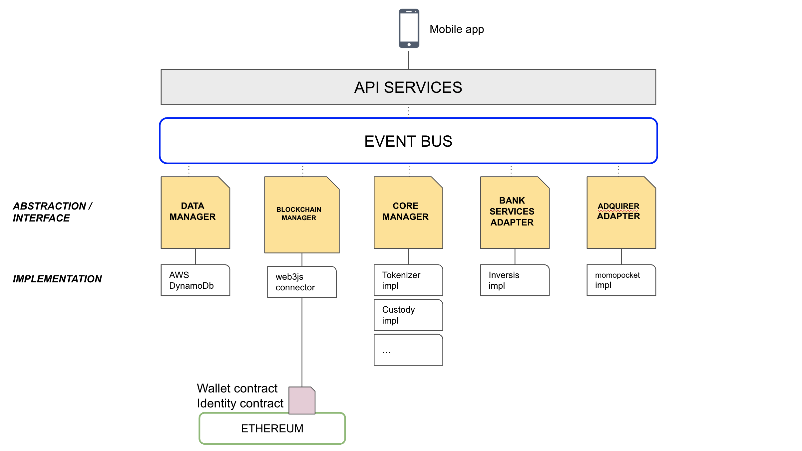

# iobuilders

> My architecture proposal for iobuilders intervew.

 This is a simple guideline for the presentation and argumentation of my proposal, avoiding verbose descriptions of the operation and implementation of each component. Each component will have its explanation and argumentation in the greatest detail that you can need in the interview. 

Many of the chosen technologies and implementations have been based under the following conditions, taking into account that in a real productive project others could be considered:

* Proof of Concept context. Not final product.
* Different possible technologies involved.
* Ability to iterate and modify quickly.
* Time to finish the PoC.

## Contents

- [Tech + Architecture](#Tech+Architecture)
- [Team](#Team)
- [Culture](#Culture)

---

## Tech+Architecture

### Architecture motivation
Define an event-driven architecture that allows us to communicate in an efficient and scalable way all the components, separate their responsibilities and be prepared for changes in their implementations.

### Architecture High Level Diagram

### Components container anatomy

Most of the architecture components will be designed under the definition of  containerized applications (docker images) with the objective of automating deployment, scaling, and management.

Use Kubernetes for:

* Automated orchestration and deployment of containers.
* Service discovery and load balancing.
* Security and configuration management.

### Components
#### **`Event Bus`**
* Intent
	* Provide an event-driven architecture to communicate all components, which allows them to be scaled, updated, and deployed independently (decoupled). 
* Implementation
	* [Amazon EventBridge](https://aws.amazon.com/es/eventbridge/)  
* Motivation
    * Integration of heterogeneous components.
    * Decouple components.
    * Develop with agility.
    * Audit and monitor all events in architecture.
* Risks
	* Cost of service in AWS.
    * Need very high fanout in production (thousands or millions of endpoints).
* Collaborations
	* All components (except mobile app). 
#### **`Mobile App`**
* Intent
	* Provide an mobile app for Android and iOS. 
* Implementation
	* Use Hybrid approach with JavaScript (or TypeScript), HTML and CSS and Cordova.
    * Use Web Components to build Front end.  
* Motivation
	* Reuse same code for two targets (Android and iOS).
    * Improve the time-to-market in the different markets.
    * Be standard and framework agnostic.
    * The simplicity of Web Components makes development faster and easier.
    * Web Components by definition facilitate customizable contexts.
    * Web Components use low level browse APIs. Good performance.
* Tech Risk
	* Use some native hardware mobile capability that is not yet exposed via API or cordova plugins. 
* Collaboration
	* API Services. 
 
#### **`API Services`**
* Intent
	* Provide an set secure microservices to interact with a server-side system to retrieve and/or update data from mobile app.
* Implementation
	* Node JS. JavaScript (or TypeScript)
    * [LoopBack](https://loopback.io/) 
* Motivation
    * Create dynamic end-to-end REST APIs quickly.
    * Define API endpoints and schemas using the OpenAPI standard.
    * Define different responsibilities.
    * Authentication and authorization.
    * Integration with microservices deployment infrastructure such as Docker and Kubernetes.
* Risks
	* Complex scenarios in production. 
* Collaborations
	* Core Manager.
#### **`Core Manager`**
* Intent
	* Provide a module to orchestrate and coordinate the functional logic of the system. Contains the main implementation of the different core pieces. 
* Implementation
	* Node JS. JavaScript (or TypeScript).
    * Lambda or [LoopBack](https://loopback.io/) controllers.  
* Motivation
	* Define specific business funcionality services for Tokenizer.
    * Define specific business funcionality services for Custody.
    * Define common behaviors for all components. 
* Risks
	* Couple business funcionality. 
* Collaborations
	* API Services
    * Blockchain Manager (through Tokenizer and Custody internal modules).
    * Data Manager.
    * Bank Services Adapter.
    * Acquirer Adapter.
#### **`Data Manager`**
* Intent
	* Provide a communication interface with the database. 
* Implementation
	* [Amazon DynamoDB](https://aws.amazon.com/dynamodb).  
* Motivation
    * Focus on performance, scale and security.
	* Store secure ethaccount-IBAN, business states and operations history with encryption.
    * Store internal architecture states.
* Risks
	* Need cryptographically verifiable or relational database. 
* Collaborations
	* Core Adapter. 

#### **`Blockchain Manager`**
* Intent
	* Provide a modular, reactive connector for working with Smart Contracts and integrating with clients (nodes) on different blokchains (ie: Ethereum).
* Implementation
	* Node JS. JavaScript (or TypeScript).
    * [web3js](https://github.com/ChainSafe/web3.js) 
* Motivation
	* Interact with a local or remote ethereum node using HTTP, IPC or WebSocket (Geth, Erigon, Quorum, Infura, etc.)
    * Call Smart Contracts deployed in Blockchain.
    * Extend funcionality to others Blockchains.
* Risks
	* Vulnerabilities, bugs that require connector maintenance. 
* Collaborations
	* Core Manager.

#### **`Bank Services Adapter`**
* Intent
	* Provide a connector to Bank Services. 
* Implementation
	* Node JS. JavaScript (or TypeScript).
    * Lambda or [LoopBack](https://loopback.io/) controllers.  
* Motivation
	* Decouple architecture from third party bank services.
    * Posibility to extend to others Bank Services.
* Risks
	* Vulnerabilities, bugs that require connector maintenance. 
* Collaborations
	* Core Manager. 

#### **`Adquirer Adapter`**
* Intent
	* Provide a connector to adquirer. 
    * Implementation
        * Node JS. JavaScript (or TypeScript).
        * Lambda or [LoopBack](https://loopback.io/) controllers.  
    * Motivation
        * Decouple architecture from third adquirer api (momopocket).
        * Posibility to extend to others adquirers.
    * Risk
        * Vulnerabilities, bugs that require connector maintenance. 
    * Collaborations
        * Core Manager. 

#### **`Wallet/Identity Contracts`**
* Intent
	* Provide Smart Contracts to handle business logic in Blockchain (erc20 tokens, wallet, etc...). 
* Implementation
	* Solidity.
    * Based on ERC20, ERC725 standars.  
* Motivation
    * Use standards for token implementation.
	* Allow for self-sovereign identity.
    * Secure user data and identity.
* Risks
    * Security.
    * Costly functionality and gas limit.
    * Rentrancy.
	* Bugs in contract logic.
    * Cost transactions.
    * Time transactions. 
* Collaborations
	* Blockchain Manager. 

### Technical Processes

* Version Control and Branch Management (monorepo approach).
* Continous Integration (Automation and Fast Feedback Loops).
* Continuous Delivery (Releases and deploy into manageable pieces).
* Code Review Flow.
* Testing
    * Unit Testing.
    * Functional Testing.
    * Performance, Load, and Stress testing.
    * Disaster recovery.

## Team

| People | Role | Skills |
|---------|------|--------|
| 1       | Software Engineer - Frontend    |  JavaScript (or TypeScript), HTML and CSS     |
| 1       | Software Engineer - Backend    | Node JS. JavaScript (or TypeScript)       
| 1       | Senior Software Engineer - Fullstack |   JavaScript (or TypeScript), Cloud and DevOps     ||
| 1       | Senior Blockchain Engineer|   Blockchain & Solidity     ||
| 1       | Tech Lead|   JavaScript (or TypeScript), Blockchain & Agile *     |

(*) Being a proof of concept, the tech lead will assume the role of scrum master and main agile organization tasks

## Culture

* Use agile behaviours and practices which enable organisations, teams and individuals to be more adaptive, flexible, innovative and resilient. 
* Members must manage 'Three Pillars': Humility, Respect and Trust.
* Avoid Information islands: parts of an organization that don't communicate with one another or use shared resources.
* Scaling questions: Group chats, office hours and tech talks and classes. 
* Scaling organization's Knowledge: codelabs, staying in the loop with newsletters, etc...