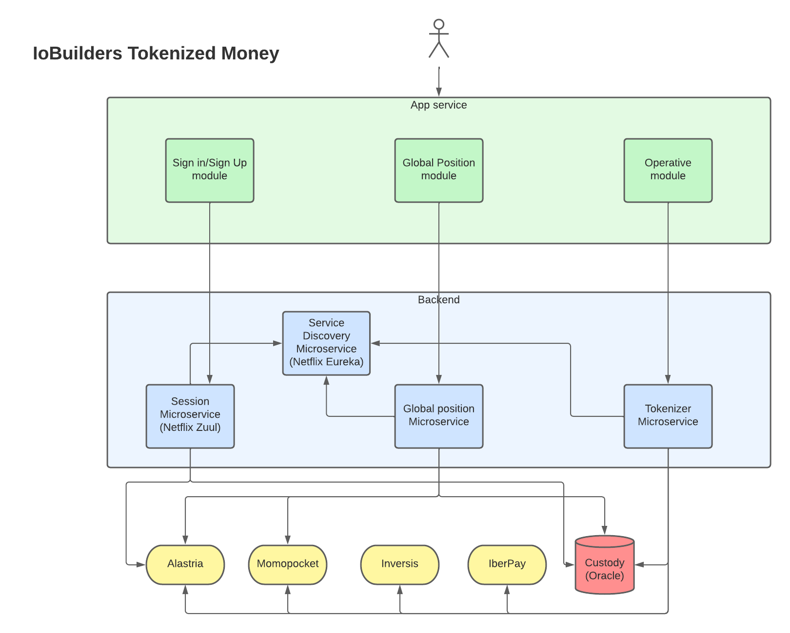

# POC IoBuilders Tokenized Money

#### Author: Christian Álvarez Sánchez
#### Date: 04/03/2022

Problem describe: One of the key components of Iobuilders, will be the Tokenized Money Feature.
A quick summary of this feature is the ability of converting a fiat currency into a token, and
viceversa, on an easy and fast way, following all the defined regulations and laws. To be able
to build this functionality, the following puzzle pieces need to be build:

- Mobile App
- Tokens
- Operate on the banking system

## Tech and Architecture

### Diagram

### Architecture
It must keep in mind that this kind of software is using money and how every software it will have bugs, errors, fails,
server down, etc. For this reason the POC has to have a big focus in the resilience. First we will use Kubernetes which
is a portable and extensible open source platform for managing services These Kubernetes will be in the local cloud if
the company has one or we can use AWS, CLOUDERA, AZURE. If we think in economic terms we will use cloudera because it
is the cheapest. With this both technologies we can implement a good resilience system with several pods, logs, and
easy manage. Besides, we can implement some kind of circuit breaker to avoid overload our backend when we can not provide
a response to the user.

### Mobile App

The Mobile App will be developed in iOS and Android and we have identified three important modules.
- Sign In / Sign Up Module: This module is pretty important because it is our front door from the user point of view.
  For this reason, this module has to be friendly with the user with clear interface, besides it has to have the
  possibility for the user, if he/she has some disability can listen the fields to fill. This module connect directly with
  session microservice which will be described below.
- Second module is called Global position. This module will show to the user his/her position inside the app. For
  example, how much money has, some statistics, what products they have, or his/her financial health. We have to keep in mind
  that the information in this module has to be shown clear and understandable. This module will communicate with Global
  position microservice which will be described below.
- Last module will be Operative module, which will manage the operations to converting fiat money in a token. This
  module is also important in the UI/UX because the user has to feel comfortable when he/she does some operatives. This
  module will communicate with Tokenizer microservice.

All of them will have to implement some kind of help to handicapped people such as blind people

### BackEnd Environment
In this section we will describe the backend environment and its different microservices

#### Service Discovery Microservice
This microservice will be the manager which register every instance of our system, that is our microservices. We will
use Netflix Eureka because is easy to use and has a lot of documentation in web. So, its implementation will be fast.

#### Session Microservice
This microservice manage the customer account (create and sign in).
Technologies:
- Spring boot
- Spring session
- Netflix Zuul
- Custody (Oracle)

Its functions will be:
1. Interface with Alastria to create a wallet and identity.
2. KYC(know your customer) and use risk engines like FATCA, CRS, etc. to check that the customer can create an
   account.
3. Zuul: We will use Netflix Zuul how proxy to redirect the request to other microservice
4. Save and get session info from Custody (Oracle)

Here we find two ways: Create user and Login user
1. Create user flow: The request from Mobile app is received by zuul and check the role and authority (in this case,
   any customer can reach the endpoint). Next, the microservice will check KYC customer info and if everything is right,
   the account will be created using an interface to communicate with Alastria where a wallet and identity will be created.
   Finally, the response will be returned to the customer with his/her new account. We will use Spring boot and Spring
   Session and the user info will be saved in Custody
2. Login: The request from Mobile app reaches the microservices with user and password and Zuul will check roles and
   authorities from Custody db and returns login correct.

This microservice requires security and resilience, so we must implement some kind of circuit breaker (resilience4j) and
to check the well-function we should do unit test and integration test, maybe with test container (TDD). Finally, we
will build this microservice with hexagonal architecture and DDD.

#### Global Position Microservice
This microservice will get all information related to the customer. Some kind of statistics, financial health,
products and recent transactions. It gets info from Alastria, Momopocket and Custody, will process the data and will
return to Mobile to show it to the customer

Technologies:
- Spring boot
- Spring Reactive libraries
- Custody (Oracle)
- Alastria Interface
- Momopocket Interface

Its functions will be:
1. Get Alastria customer information
2. Get Custody data
3. Get Momopocket customer information
4. Process data

This microservice will get custom information from several knowledge sources. To carry on this job we will have to
implement two interfaces to comunicate with Alastria and Momopocket. This info will be merged with Custody information
in a Domain object. After, we will process this info using reactive programming and at last but not least we will return
an DTO object with some king of grouping data like expenses, income, grouping by merchant, kind of product, etc.
Therefore will show last transactions and his/her financial health. In future, we can implement some kind of future
forecast or economic trends.

This microservice requires security and resilience, so we must implement some kind of circuit breaker (resilience4j) and
to check the well-function we should do unit test and integration test, maybe with test container(TDD). Finally, we
will build this microservice with hexagonal architecture and DDD.

#### Tokenizer Microservice
This is the most important microservice of our environment. It will transform from fiat money to tokens and viceversa.
This requires distributed data transmission system with capacity for horizontal scaling and fault tolerance. For this
reason we choose Kafka to manage the money-token events.

Technologies:
- Spring boot
- Reactive libraries
- Apache Kafka
- Custody (Oracle)
- Alastria Interface
- Momopocket Interface
- Inversis Interface
- Iberpay Interface

Its functions will be:
1. Receive kind of operation
2. Communicate with third parties
3. Tokenizer/De-tokenizer money
4. Response with success or fail and save in Custody

The flow will be, first the customer requests operate with fiat or token. So we have to implements Alastria, Momopocket,
Inversis and Iberpay interfaces to communicate with them and do the operation. The request/message will be sent to
kafka topic and will be taken by consumer and at the end tokenizer the money. This Spring boot must use reactive libraries to improve
the efficiency. With Kafka and Zookeeper, we get resilient and fault tolerance with replication index of 2n+1
Finally, we will save all the information in the Custody (Oracle).

This microservice requires security and resilience, so we must implement some kind of circuit breaker (resilience4j) and
to check the well-function we should do unit test and integration test, maybe with test container (TDD). Finally, we
will build this microservice with hexagonal architecture and DDD.

#### Common technologies
- Java 11
- ELK (Elastic Search, Logstash, Kibana): Logging the application, events, services, logs, errors, etc.
- Prometheus: Get metrics of our environment
- Grafana: Monitor our environment such as response time, number of request, memory use, pods up/down, etc.
- Openapi: To describe our endpoints and subscribe between them

## Team

It is required a multidisciplinary team. For this reason we need to build a te with different roles
and capacities. It is described as follows:
- 1 Product Owner, who prioritized the backlog, check and test the product and he/she will have to be in continuous communication with the stakeholders
- 1 Mobile developer specialized in Android
- 1 Mobile developer specialized in IOS
- 1 Front-End Developer with UX/UI skills who will help to mobile developers when he/she is with less load work
- 2 Back-End developers who will build the microservices software
- 1 DevOps engineer who will build the infrastructure and will help to back-ends if it is possible
- Scrum master role can be rotated.

## Culture

The work culture within a company is a facet that has become important in recent years. For this reason, we propose
that different methodologies be used so all people will feel part of the growth of the company and feel the software
as their own, grows thanks to them.

The work methodology must be Agile in two week sprints, so we will have eight sprints to carry out our work. In
addition, we will have different communication tools such as slack or teams, to communicate, send files, meetings, etc.
Another important tool will be Jira to keep track of the status of the tasks and manage the sprints and the backlog.
Also, a Confluence will be necessary where you can share relevant information or ideas for the team. Finally,
control version like Git and common repositories for each module/microservice.

We cannot forget the most important tool for a digital worker, the computer. When there is a new incorporation to
the company the worker should have the possibility (within the economic capacities and security) to be able to choose
the platform on which they will develop their work, Linux, Mac, Windows. This not only will it make the worker feel
comfortable but, from my point of view, it has a great influence on the productivity. For example, being able to have
the tools, plugins, programs, etc. that make life easier for the worker, always thinking before in security.

Another of the most important facets is to have an open mind, to change, to different opinions and points of view.
That will enrich the conversation. Everyone within the team, the project and the company has to feel integrated and
both the company and its members have to move in that direction. This will enhance the teamwork. Working as a team
divides the work and multiplies the results.

If we focus on the work methodology, we should use TDD (Test Driven Design), DDD (Domain Driven Design) and
architectures that complement these two methodologies, for example the hexagonal architecture. Finally, we also have
to encourage, never impose, the use of good design and programming practices, such as they can be those described in
the Clean Code and SOLID principles. 