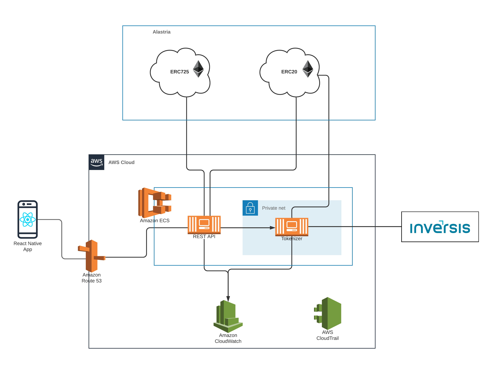

# IoBuilders Tokenized Money PoC

## Tech + Architecture

In order to sove the problem, the system will be composed on this components:

- **Mobile App:** the mobile application, where the user will be able to interact with the wallet and operate with the SSI.
- **API server:** a REST microservice, which will act as a middleware between it and the smart contracts and tokenizer.
- **Smart contracts**: an ERC20 contract for the emoney wallet part, and a ERC725 for the SSI part.
- **Tokenizer**: the component that will pick money for the bank and transform it into RC20 tokens, and viceversa. It will be another microservice.
- **Events logger**: where all the logs will be stored.

First of all, I would go for a **microservices architecture** here, so that each of the modules is isolated from the rest, and can be reused and scaled for it's usage in other ventures built later. It will also allow us to have each part written in a different language, that serves us better for each one of the components' goal.

Let's dive deeper into each of the modules.

### Mobile App

The app needs to be delivered both in iOS and Android ecosystems. As such, we have 3 different options:

#### Native Apps

This would be the best option in case the project would be bigger, or require a dedicated look and feel, as it is the option that offers more flexibility. The drawback is that it would recquire 2 different developers, one for each OS. In our case, as it is a PoC and we need it to have it delivered quicker and with as many resources as possible, and also we don't need a dedicated look and feel, I discard it.

#### Hybrid or PWA apps

This is a better option in terms of development speed, as it would just recquire Javascript knowledge, meaning that you will need just one app to be developed and then you candeploy it both in Android and iOS. The problem here is that the look and feel is worst than in the previous option. I'm discarding it, as I think the next option has the best of both worlds.

#### Cross-platform mobile frameworks

This option allows us to have both native apps, but just write them once, since they use a common language to later compile it into native code. So, here we have the best look and feel with also development speed. Here we have options like React Native or Flutter.

> My propposal is to use **React Native** over Flutter. It allows us to have both native apps, written in React (Javascript), as opposed to Flutter which uses Dart. This helps for our idea of having a fullstack team, as it does not require developers to learn a new language. Also we would need to make automated tests with **Jest**.
> Also, as UX/UI is important, but we don't have any designs or specific interface to be done, I would suggest to go with [React Native Paper](https://reactnativepaper.com/). This will allow us to follow a standard like **Material Design** in terms of app UI and animations, but avoids us to develop a full UI framework (which is quite big). In case needed, it's personalizable and can be easily modify, but takes us away of having an aditional UX/UI designer + layout developer.

### REST API Server

In order to achieve our idea of having a fullstack team, I proppose here to use a **NodeJS** server, using Typescript. This will lead to a seamless development, as we are using Javascript also in the Mobile app, and will make it easier to find developers who have used both frameworks. It will also allow us to have automated tests using Jest, which I think is important as the components will be used in other apps of the company.

It can ber deployed as a Docker container inside Amazon ECS, which will also allow us to use AWS Cloudwatch for the events logger.

It may be interesting to use [Swagger](https://swagger.io/), which follows the Open Api specification, to have the API documented. This way, when a developer needs to use an endpoint developed by other team member in example, or future projects connect to this one, params needed for each call are easily found.

> I think it's a better idea to have this server than directly connect the apps to the contracts (i.e. via Web3), because it will help for the events logger part. I also think this component helps in the orchestration of the rest of the system, being it the core component and glueing the contracts, mobile app, tokenizer and logger. Furthermore, an aditional abstraction level makes it easier to decouple all the components, making them more reusable for other apps in the company.
> Automated tests should be doune with **Jest** too.

### Smart Contracts

To be able to have the emoney wallet, we need a contract compliant with RC20, as it wil be based on Ethereum. Same goes for the SSI, so we will need an RC725 compliant contract.
For the SSI, maybe would be interesting to use [Ceramic protocol](https://medium.com/ceramic/introduction-to-the-ceramic-protocol-8d56951ae3f).

> As I'm not a Blockchain dev, this is the part I'm lacking most. I would need a better knowledge or help from an expert.

### Tokenizer

We need this component in order to connect to the bank account, thus being able to topup money in an Eth account after transforming fiat money withdrawn from the bank account into a token, and viceversa. I will also take care of all the secutiry services needed to connect to banking software, tokens custody (maybe with Coinbase), eth. For this server I suggest again **NodeJS**. This is because it serves us better in our goal to have a fullstack team. I have also found it very reliable in other projects where the data privacy and security were critical. Anyway, in case the bank we are doing the integration with prefers another more commonly used language for this task, we could go with **Java**.
Another risk here is that maybe SDKs for NodeJS does not exist for the components we need to integrate, so it will recquire a further grooming to check that we have the tools to develop everything that we need for the Tokenizer.

I think [Swagger](https://swagger.io/) is a must here, so that when future services connects to this one, developers will find it much easier to know all the endpoints and params needed.

> Same here as the previous component. I'm laking the knowledge of converting fiat money into a digital token, so I would need more expertise or help from someone.
> The point of having this one as a standalone component is that we can reuse it in other company applications, as all the tokenizer logic would be inside just one place. The rest of services can connect to this one (via https) in order to use it.
> As with the other microservice, automated tests will be done with **Jest**

### Events logger

As the system needs to be audit, I would suggest to use a mix of **AWS Cloudwatch** for app logs and **AWS CloudTrail** for AWS system logs. Furthermore, it may be interesting to have a look at [Datadog](https://www.datadoghq.com/pricing/?product=log-management#log-management), although this is a paid service.

### App deployment

- Both iOS and Android apps will be deployed in their respective app stores.
- Tokenizer and API server will be deployed as Docker containers inside an Amazon ECS cluster.
- Both ERC20 and ERC725 will be deployed inside Alastria network.
- More AWS services may be needed, like **Route53** for DNS, **S3** in case the mobile app needs some static assets, **System Manager** for env variables, etc

Here's the overall architecture diagram:

Also, automated tests needs to be done in order to ensure the code keeps working when changes are made, and a CI/CD tool is needed. My proposal is **Travis**, running first the tests when a commit is pushed and then, if passed, deploying the apps in their respective place.

As this is a POC, I don't think we need multiple environments, so maybe just a development one and a production/release one in order to ddeploy the final result.

## Team

For this project, I propose to have 4 fullstack developers. The reason for this is that I have found that having a team like this is more flexible in case one of the parts needs some extra work that was not properly estimated. It also helps in case some of the developers are away (holidays, sickness, etc) as some other team members can take their work in case it's needed. Moreover, in case there is a blocker in any part, each one of the develpers can solve it, not having to wait till other developer unblocks it.

Ideally, the 4 members would have knowledge of React, NodeJS and Solidity. But as blockchain is such a recent technology, this may be hard to achieve. To leverage that, I suggest to have 2 medior and 1 senior fullstack developers with knowledge about React (even better if they have experience with React Native) and NodeJS. I would also suggest another fullstack senior developer that has some knowledge or experience with Solidity, as well as with NodeJS (and ideally React - React Native too). This way he can teach the rest of the developers and take the lead about this part.

At least 2 of them should have some sort of infrastructure deployment experience, so that the system is deployed and runs, although this is a part that all members of the team will learn too.

Anyway, all the developers should have great learning skills and willing to learn new technologies, as this is such a recent field and they may face challenges that haven't been resolved yet by other devs.

## Culture

As for the culture, I would suggest an agile methodology like **Scrum** with flexible sprint times, but starting with 2 weeks sprint, and including daily standups in the mornings. This allow for a continuous iteration and review of the goals achieved in the project, as well as good team communication and visibility of everyone's job and project status. After every sprint, there will be an sprint planning to select the tasks for the next sprint and estimate them, as well as a **Retrospective meeting** so that we can fix the things done wrong, keep the things we have done right and keep improving the processes. Goal here is to have the minimum number of "protocolary" meetings, so that developers have more time for development and have their own technical meetings regarding functionalities, etc.
I would suggest to put all the tasks that are estimated for the sprint so that the developers can pick the ones the preffer. This way they can work in every part of the app.

Regarding the development process, I would suggest having **Pull Requests**, so that the code is reviewed by multiple people, which leads to a better code quality and sharing of knowledge. It would be also good to have some **Pair Programming** sessions when some team member needs to learn any part of the app, as I have found it quite useful as a learning tool. Finally, it would be great to have some sort of **Lightning Talks** biweekly, so that one member of the team can explain one feat achieved in the sprint to the rest of the team, thus ensuring our goal of everyone's having knowledge of all parts of the app. This also pays off as we will have experts for other ventures.

As communication tool, I would use **Slack** as chat and **Google Meet** as real-time meeting tool, as well as **Gmail** for emails.

## Final thoughts

With the architecture and stack of technologies selected for this app, and being the domain of the problem one that deals with very sensible data, there are 2 main risks:

1. Without much knowledge of both smart contracts and banking software for tokenizing, the number of people needed may be underestimated, so we may need to be open to hire more people if the project doesn't meet deadlines. Maybe another fullstack senior developer.

2. Security here is a must, so we need to ensure that the communications are using security standards (such as https) and that we encrypt the information. Also, we need to ensure that both smart contracts and tokenizer module are used within our systems, not opened to the public or 3 party apps. We will also need to authenticate and authorize the REST service API calls.

3. Tokenizer part should be groomed to ensure we can make all the functionality recquired with the proposed language (NodeJS), although it shouldn't take too much time.
