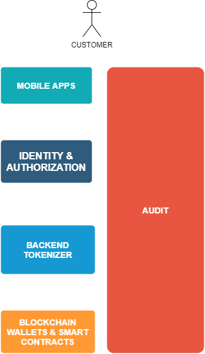

# Tech + Architecture

## Components of our system:

- **Blockchain wallets** *The wallets of the users and the smart contracts.*
- **Identity, Authorization** *We need a system to meet identity, authorization and management*
- **Tokenizer services** *Our REST services will represent the required resources and actions.
- **Mobile apps** *The interface that our customers will use to perform the actions (send, withdraw, etc)*
- **Audit** *We need to log all (excluding sensitive data). Fully traceable.*

### Blockchain wallets
TO-DO: Im not an expert in this area.
My unique recommendation is use ***cold wallets*** to guarantee full security
(prevent attacks from money stealers).
 
### Identity & Authorization
TO-DO: OAuth2, OpenID, JWT???

### Tokenizer
**Microservices** oriented architeture. We need to **decouple** all our **services** to keep them independant of each other.
Another alternative is ~~**starting with a big monolith**~~, but if our team have good experience with microservices, why not?

**REST**:  The best approach.
***GraphQL?*** Is the data consum very important in mobile networks?
***~~SOAP is terrible.~~***

***Static languages*** over dynamic languages. More secure and static type checking (less testing and errors). In my experience, it is more difficult find dynamic errors in languages like Java and TypeScript for example versus Python and JavaScript.

Recommendation: 
- Any ***JVM language***. (Java, Groovy, Scala, Kotlin). Good performance and good community of developers to hire.
- Other proposal. ***RUST lang***. Better performance (fully compiled) but more difficult to hire people.

### Mobile apps
 * Hybrid apps (PWAS) (Ionic)
	- Not an option. Too much limited. Poor performance.

 * Cross platform development (compile to native) (React Native, Xamarin)
	 - Good performance. Compile to native.
	 - Faster development. Easy deployment. Good look and feel.
	-  Can we get some limitations but will be a good point to discuss.
	-  My experience using **React Native with Expo framework** is really nice.
	 - I did not get limitations in my personal uses casos (cryptography, etc)

 * Native. (Android SDK, iOS SDK)
	 - Best performance. Native SDKs. Best look and feel.
	 - Two codebases to mantain.
	 - No limitations. Fully access to all features.
	 -  No surprises

***I recommend use a same codebase using React Native with Expo.***
Native performance, good documentation and easy learning curve (easier if you know reactjs from web).
A little few limitations (like develop C code using JNDI in Android apps, etc)

### Audit
We need to **be able** to **identify** and **search** each **actions**, attacks, etc.
We can use a middleware to audit all events.

We can orchestrate our code too, using tools like Prometheus.
Tools to discuss:
- ElasticSearch.
- Graphana.
- Prometheus.
> The code will be our source of truth.

## Infrastructure and Deployment
- Cloud based (AWS, Google Cloud, Azure)
- VPS (DigitalOcean)

I would recommend any cloud based provider, they support too much benefits out of the box.

**CI/CD Mandatory**
> We need to deploy fast with security. Our code will be our guarantee.

## Security
TO-DO: Cryptography, HTTPS/SSL, OAuth2, JWT

## Performance
TO-DO: Caches, HTTP2, Gzip, ETAGS

## Principal Actors
- Customer. Our principal actor that will perform different actions.
- Banking provider. We need to communicate to different banking or financial services.

# Team

Regarding the team:

- We are a **startup**, our first team will be **small sized**. We will have time to grow.
- In the tech side, we need to apply **fullstack development**. Each member of the team should be comfortable with all pieces of our product. This means that each member can be more oriented towards one part (specialization) but must have the ability to participate successfully in areas that are not comfortable for itself.

## Duration / Skills / Roles

We have a duration of **four months**.

***Skills:***

- Fast learning ability.
- Pro active and team players.

***Roles:***

We need to keep in mind, that each member of the tech side should be able to participate in all layers of our product, we need to hire full stacks devs prioritizing the best knowledge in specialized areas.

- 2x Backend devs
- 1x Android dev
- 1x iOS dev
- 1x Blockchain dev
- 1x Product Owner (The most important to achieve success in the market)
- 1x Scrum Master
- 1x QA
- 1x Ethical Hacker (This position can be outsourced, but we need to guarantee the maximum security) (Black Box, White Box, Penetration testing, etc)

# Culture

We will be SCRUM based.

- Sprints (2 weeks by sprint)
- Daily (mandatory to assist, but not mandatory to speak if you do not have to publish news to others)
- We will adapt other ceremonies to our benefit.
- The start usually is hard but the team will pick up a regular speed and automations little by little.

- TDD, BDD, pull requests.