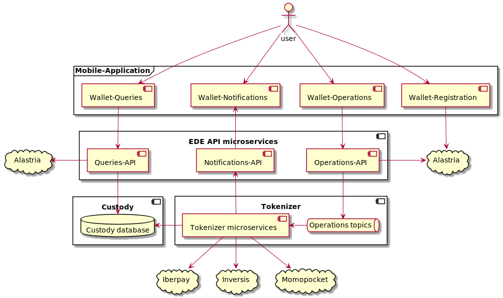

# iobuilders - Tokenized Money POC

#Introduction 
This document describes my (Fernando Bastante Perez) answer to the
[Tokenized Money POC](https://github.com/Ferparishuertas/iobuilders/wiki/IoBuilders-POC) from ioBuilders.

# 1 - Tech + Architecture
We are describing here the parts that need to be implemented by us for the Tokenized Money feature:
  * Mobile application 
  * EDE API microservices
    - Queries API
    - Operations API
    - Notifications API
  * EDE Core 
    - Operations topics (Kafka topics) 
    - Tokenizer (microservices)
    - Custody (SQL database)
  * Auditing system (not shown in diagram)
    - Elasticsearch
    - Kibana

All the microservices would be implemented with Spring Boot and deployed using a kubernetes cluster. By using
the kubernetes services and health checks we ensure the high availability of the system and if we need to increment
the number of instances of an element, we can do it quickly. We would need to study further requirements to see if we
need an on prem cluster or if we can use AWS (or another cloud) to deploy the PoC. For the auditing system,
we would use Elasticsearch to digest and store data + Kibana to visualize it. 
  

### 1.1 - Mobile application
##### 1.1.1 - Description and Components
The mobile application will be the frontend for the users. It will need some visual/GUI design/development to show all 
the wallet information and options to the user. Internally, the application will need 4 modules to allow these
operations:
  * EDE registration using Alastria
  * Information queries to the EDE system (check my tokens, transactions, etc.)
  * Operations to the EDE system (do new transactions)
  * Receive notifications from the EDE system (for example, when a transaction is actually done)
  

##### 1.1.2 - Tech
The Mobile Application will be implemented for iOS and Android as per requiements. We would need to check the best way 
to design an implement a GUI application for both technologies. Both technologies will use the same API and the GUI
should be similar, we could explore using tools like trigger.io to create the native application using common HTML.
If they work fine for the PoC, we could save some development costs.

### 1.2 - EDE API
##### 1.2.1 - Description and Components
This component will be an access layer for the mobile application or other systems using our tokenizer. All the elements
in this component will be microservices. We are going to divide/group the interactions from the Mobile Application
in two types:
  * Queries and operations that can be synchronous and we can afford to have failures. 
  * Operations & transactions that must be asynchronous to ensure that isn't lost in case of failure.

Additionally, we have included here a third group of interactions for the notifications needed to confirm the final 
status of the asynchronous operations. This is the notifications group.

So, we would have these groups/components:
  * API Queries. This group of microservices would publish an API to get the wallet information. To get this
    information, those microservices would check user credentials and then query the Custody database 
    to get the history of transactions, the detailed information for a transaction, etc.
  * API Operations. This group will contain all the microservices publishing the API calls which starts a new
    tokenizer operation (new transactions). These microservices won't do the operation directly, they would check 
    user credentials, the initial transaction information, and then they would send the operation as a Kafka
    message into a topic.
  * Notifications. This group will contain all the microservices publishing an internal API to send notifications to
    the Mobile Application. Initially, this group will be used only by the Tokenizer microservices to notify the
    Mobile Application of completed transactions.

##### 1.2.2 - Tech
As commented before, the microservices will be implemented using Spring Boot and will run in a kubernetes cluster. We 
can do the load balancing and failover using services and health check probes from kubernetes. Initially, we would use
the same kubernetes namespace for the 3 API groups and one kubernetes deployment per microservice (we probably would
have more than 1 microservice per API group). However, if the number of microservices per group is too high, we could
split and use one namespace per API group.

##### 1.2.3 - Checks to be done with the PoC
We would need to make further study to propose a number of microservices in each group. Additionally, it's something
that could change as we go further with the development. We would start with a number of microservices with some API
calls, but it's pretty probable that additional calls will appear during the development, and the number of
microservices in each group could increase.
  

### 1.3 - EDE Core
##### 1.3.1 - Description and Components
This component will be the core of our EDE System. It would contain all the tokenizer logic and the storage of the 
transactions that are already completed or failed. The entry for the system will be a group of Kafka topics, used to 
store and transport the transaction operations from the Operations API to the tokenizer microservices.

The tokenizer microservices would work by this archetype flow:
  1 - Consume message from the Kafka topic associated to that microservice.
  2 - Try to do the fiat transaction by sending operations to the Third Party Systems (momopocket, Iberpay, Inversis)
      and running the necessary logic to create the transaction token.
  3 - Add transaction token to the blockchain and update Custody database.
  4 - Notify the Mobile Application of the transaction outcome using the Notifications API.

If at anytime during that flow, the microservice find any critical failure, it would ensure that the Kafka message is
not acknowledged, so it goes to a Dead Letter Queue to retry it within some time.

The Kafka topics should use some grouping and partitioning to ensure that operations from a user are processed in order.

##### 1.2.2 - Tech
As we had with the API microservices, the tokenizer would be implemented using Spring Boot and deployed with kubernetes.
We would use another namespace for the tokenizer microservices and, as we had for the API groups, one kubernetes
deployment per tokenizer microservice (assuming that we will have more than 1 type of microservice here).

The Kafka topics would need to be deployed in the kubernetes cluster, as another namespace. We could use Confluent 
(https://docs.confluent.io/operator/current/overview.html) to deploy it in the on prem kubernetes cluster or in AWS.
The number of topics to be created will depend on the number of tokenizer microservices. We would have 1 topic per 
tokenizer microservice.

The Custody database would be an SQL database. We need to consider if we want to run it in the kubernetes cluster, but
it probably would be better to run as a separate instance in dedicated hardware or, if we want to use AWS or another
cloud, dedicated instances. We would also need to consider high availability and failover for the database before
choosing between different providers.

##### 1.2.3 - Checks to be done with the PoC
The first area where we would need to do some research is regarding the retries of the failure transactions. We will
need to check that the Dead Letter Queue is a valid mechanism and define time between retries, the number of retries
before the transaction is finally dropped and marked as failed, etc. 
We would also need to do some further study to check that we really have atomic transactions using this mechanism or if 
we need to change something.

### 1.4 - Auditing system
##### 1.4.1 - Description and Components
The auditing system would be a non-functional piece, that would be storing events, transactions  and logs that take 
place in the EDE system. It will be an Elasticsearch engine for digesting and storing data and Kibana to visualize it.

We would send all the microservices logs to the Elasticsearch engine using beats or logstash. This way we have stored 
all the raw information of the flows running in the EDE system.

Additionally, we would need to consider if we want to have specific and filtered event records in the auditing system.
If it's the case, we could do it adding one or more specific Kafka topics to send them from the microservices to ELK
at specific points of the API calls/tokenizer flows. The microservices would send the event record to those Kafka
topics and we would use a Kafka Connector to send it to logstash or directly to an Elasticsearch index.

# 2 - Team
We would need to re-evaluate this once we do further study for the number of calls, number of microservices, etc. For 
the moment, as it's a PoC, we will assume that we will have only one microservice per type:
  * 1 Queries API
  * 1 Operations API
  * 1 Notifications API
  * 1 Tokenizer

We have 6 areas of work:
  * Installation/Deployment of Kubernetes Cluster
  * Installation/Deployment of Kafka cluster
  * Installation/Deployment of Auditing system
  * Development of Mobile Applications
  * Development of API microservices
  * Development of Core (tokenizer + database)

For the installation/deployment tasks, we would need 1 person with deep knowledge in docker, kubernetes, AWS, 
elasticsearch, kafka, etc. It's pretty probable that this team would be busy at the beginning of the project (creating
all the environments), but they would be free during many phases of the project. If they have expertise in Java,
they could be included in the development team during those phases.

For the development team, we should consider dividing it in 2 separate "sub-teams":
  * Mobile Application team. For this team we would need 2 people with knowledge in GUI designing and development for 
    mobile applications (iOS and Android). If we can't reuse the code for iOS and Android, we should consider an 
    additional developer.
  * Microservices team. For this team we would need 2 people with Git, Java, Spring Boot, Maven, SQL databases,
    Docker and Kubernetes experience.

# 3 - Culture
The development of the PoC should be a collaborative project. All the people involved in the PoC should work as a team,
there shouldn't be any team separation between mobile/microservices/deployments. When looking for solutions, all
the people should focus on reaching the best solution in a global way, not the one that is easier for "my team".

The team should be focused on developing and ensuring the work done is reusable and it has good quality. The team should
not have date pressures that makes them to skip necessary tasks to make the development quicker. It doesn't make sense
to complete the PoC in 3 months, if we can't reuse it later.

We should consider using agile methodologies with a Kanban-style board for the tasks. But it's important to ensure
that the team focus on the real work done, and not just closing tasks in the board. The most important thing is the
actual development, not the board.

The team should be also aware of creating automatic unitary tests (Junit) to avoid introducing bugs with the development
of new features. Combining this with a CI/CD system (Jenkins) to automatically build, test and deploy merged changes
in a "development" or "master" branch.

Regarding communication, we should use some chat like slack to quick communications/questions/synchronizations between
team members. One channel for the project where every person can write if he finds a problem, to ask something and the
team members answer responsively. Sometimes the slack conversations could be "promoted" to a voice/video call to
give a better explanation of the problem and let the involved members (or all the team) have a better view of the issue.
The important part here is that, when someone finds an issue or something that doesn't match, it raises hand and the 
issue is checked and (hopefully) solved by the team in a responsive way.

We should also implement some "standarization" of the environments for the team:
  * Each developer would have a "standard" local/personal environment. We should create those environments automatically, so a new
    member can create the environment directly when he/she arrives to the team. This way, we would have a similar
  * For example, we could have some procedure/scripts to build the necessary docker images in our laptops and then
    launch a docker-compose.
  * The CI/CD builds would be based on this environment, so we can replicate unitary testing, but also
    installation/deployment and even integration/E2E tests before deploying the release to the
    integration/preproduction/production environments.

