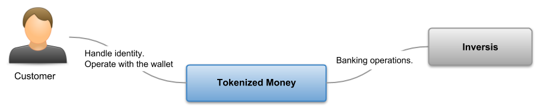
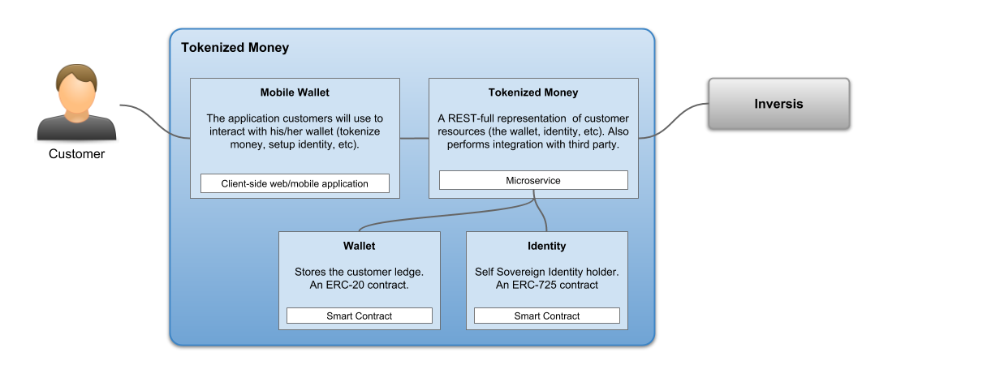
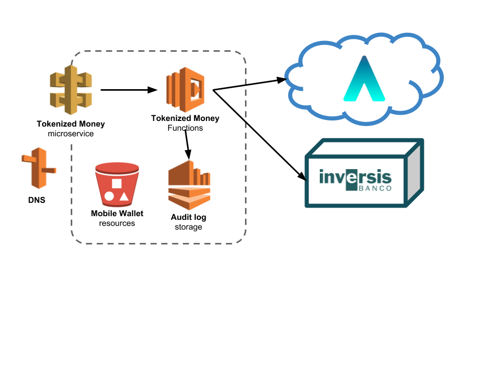

Tokenized Money PoC
===================

## Goal

This documents is the response to IOBuilders Challenge based on [Tokenized Money PoC](https://github.com/Ferparishuertas/iobuilders/wiki/IoBuilders-POC).

There is a [glossary of terms and concept](./glossary.md) used in this document.

## TL;DR

The Tokenized Money PoC system will be composed of five subsystems:

  - **Mobile Wallet**, the mobile application, based on Web technologies. Build as a hybrid/PWA application.
  - **Tokenized Money**, the REST representation of customer's resources. This subsystem will, also, integrate with Ethereum, for smart contracts, and Inversis, as third party bakning system.
  - **Wallet** and **Identity** smart contracts. Used to deal with the customer *wallet* and the *Self Sovereign Identity*.
  - **Audit log**, as an immutable log, used to store all system events.

All subsystems will be deployed over Amazon Web services, using managed infrastructure and services.

### Disclaimer

> Reganding this solution, keep in mind that I'm not a Blockchain/Ethereum/Smart Contracts expert. That's why my solution is based on a *centralized architecture* and *cloud services*, and is not designed as Distributed Application. Could be interesting open a discussion about how to build this system as a DApp.

## Architecture & technology

### C4 model

I've started defining **architectural views** of the system, following the [C4 Model](https://c4model.com/). 

The main goal of this model is describe and comunicate architecture decissions. Also, this diagrams are a great starting point for discussions about system design during up-front sessions, and also as shared vision documentation in development phases.

I've only used three of the four model views, because the *class diagrmas* is tightly coupled to implementtation, so change prone during development phases, then can become waste.

#### Context

This view defines the actors (people, roles, third party systems...) involved in the system. Also it defines the system boundaries. 

| Actor    | Description   
| ---------|:--------------------
| Customer | People using the system via the application. They will create tokens from fiat, and reverse. 
| Inversis | The company that will provide us banking services.

#### Containers

In this diagram models the application containers involved in the system, defining their responsabilities, as well as their technical roles.

> In this context a container is something that hosts code and/or data. The containers are the different parts of the system needs to be running in order for the overall system to work.

There are five main subsystems:

  - **Mobile Wallet**, as the customer UI application.
  - **Tokenized Money**, as REST services layer that represents the customer resources.
  - **Wallet**, the smart contract that handles the customer money.
  - **Identity**, the smart contract that deal with *Self Sovereign Identity*
  - **Audit log**, as the subsystem that deals with an immutable actions log.-  

#### Components

> TBD

### Technology

As seen in the container diagram, this system is composed of five different subsystems, each of them with different requisites, there will be more than one application architecture and technology involved. 

Let's split by application subsystem.

#### Mobile Wallet

This is the application the customers will use to interact with his/her wallet. It will be an IOS and Android mobile application. Other targets, like for example desktop, browser-based or Windows Phone, are out of scope.

We have two main scenarios: a **native** or a **hybrid/PWA** application. Each of the solution have pros and cons:

##### Native application

This applications are native to device target. Usually are built with the platform SDK. 

PROS

  - Platform *Look&Feel*. Better usability and UX.

CONS

  - Two applications to build and maintain.
  - Worst release rollout process.

##### Hybrid/PWA application

Hybrid/PWA applications are web applications that appears like native applications to the user.  

PROS

  - Only one application to be built.

CONS

  - Worst UX, because won't be native to the plafform.
  - No standard frameworks. Vendor lock-in.
  - If released vía store (Apple Store or Google Play) the release rollout process is quite similar to native applications.

##### Application architecture proposed

Taking into account other requirements, like time to market, quick wins, etc; and also related to initial team, I propose to build an Hybrid/PWA.

This applications will be composed of static resources (HTML pages, Javascript, CSS, images, etc), that will be interpreted by the browser. So, as the content is static, it can be deployed to some simple of HTTP server, or some kind of storage service, like *Amazon S3*. 

As there are a lot of Javascript frameworks and libraries,with a short release cycle, I propose to use as much standards as possible, like:

  - **[Web Components](https://github.com/w3c/webcomponents)**, to build the user interface components.
  - **VanillaJS**.

Because I'm not an expert about Web UI development, I don't have a strong possition about a Javascript framework, but I have read very good things about **VueJS**. 

The deployment target can be an **Amazon S3 bucket**. In case we detect huge load, we could use **AWS CloudFront** as CDN.

#### Tokenized Money

The *microservice* handles the customer resources, in the *Tokenized Money* domain. It will be exposed as a set of REST resources vía HTTP. 

To enable elastic scalability, independent rollout and going to continous delivery each resource action must be stateless. Each resource action will be implemented as a **function**, deployed as an **[AWS Lambda](https://aws.amazon.com/lambda/)**.

This Lambda functions will be exposed vía **AWS API Gateway**.

There are different languages (JavaScript, Python, Java 8, C# and Go) to implement AWS Lambda functions. My proposal is to use, if is possible, static languages.

  - The compiler perform sintaxt checks.
  - Less test needed.
  - Javascript, in Lambda service use *a bit old* Node.js version. 

So, for Lambda functions, I propose:

  - [Go](https://golang.org/). Small native static linked binaries. Very fast execution. Resource optimimzation (memory, CPU, storage, etc), so cost can be reduced.
  - [Java](https://java.com/). A big development commutity. It could ease hiring. 

#### Wallet

> TBD

#### Identity

> TBD

#### Audit Log

This subsystem should store a immutable actions audit log. This log will allow to perform after-the-fact security analisys, a key point on financial systems.

### Deployment

Based on the architecture and technology proposal, deployment on A

The initital list of AWS products to use is:

| Product     | Responsability   
| ------------|:--------------------
| Route 53    | As **DNS** server. 
| Lambda      | Execution context of all resources actions, implemented as **functions**. 
| API Gateway | Expose all functions as a **microservice**. 
| S3          | To store all application static **resources** (HTML, Javascript, CSS, assets, etc). Used as *public hosting*.
| Redshift    | The **Audit log** storage.
| SQS         | **Dead letter** queue service. It's a recovery queue to get unprocessed request when a lambda function fails (timeout, etc).
| CloudWatch  | To deal with **system and application logs**.

### Security

This system is working with financial assets, so strong security is a must.

> TBD Talk about HTTP2/HTTPS only, OAuth2, JWT tokens, AWS VPCs and roles, etc.

> TDB Use external security teams for penetration testing.

### Open points

  - How to deal with unprocessed request stored in the dead letter queue? Something to be defined.
  - Will be needed some kind of *audit log viewer*.
  - Will this system need some kind of backoffice/administration tool, to deal with customer issues?  

## Team & Culture

Regarding the team, based on this technical proposal, the team should be able to:

  - Work in a **full-stack** style. At the begining it will be a small team, so the team members should be able to understand and work in all application layers
  - Follow **BizDevSecOps** (business, delevopment, security and Operations) philosophy. Accountable for the product life-cicyle, and be able to work autonomously. 
  - Have an **agile** mindset. Inspect and adapt!!

> **You Build It, You Run it!** 

So, given this requirements, and keeping in mind the team needs roles with some technical skills, like: 

  - Expertise on AWS and automatization.
  - Seniority on UI development. Good skills on UX. 
  - Backend developemt knowledge in selected programming languages. 
  - Ideally blockchain/smartcontract knowledge. If is not possible, good learning skills, to be able to learn and work with smart contracts, blockchain, Ethereum, etc.
  - Be able to work following some development approach, like pair/mod programming, TDD, BDD, etc.
  - Define product metrics like OKRs, PKIs, etc.

> **Keep the system up and running** 
