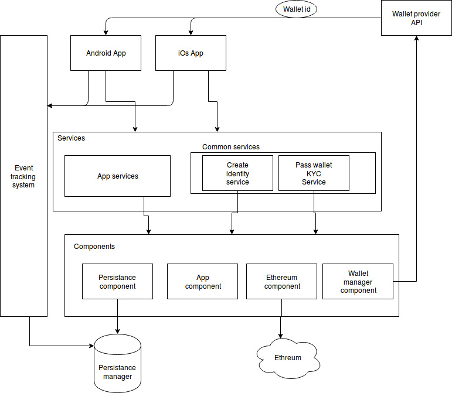

Revisión de la solución
===================

Si no he entendido mal los distintos requisitos del sistema y, dentro de las preguntas que me surgen,
alrededor de toda la tecnología blockchain, entiendo que el siguiente diagrama refleja el supuesto
esquema de la plataforma. 

## POC o prueba de concepto
Al ser una prueba de concepto entiendo que la velocidad de desarrollo de funcionalidades se 
impone antes otros requisitos como pueden ser el rendimiento, la seguridad, etc.

## Aplicaciones móviles
Habrá una parte con las distintas aplicaciones móviles (Android e iOs). Entiendo que la forma más
más rápida es hacer una aplicación híbrida para que funcione en ambos sistemas operativos.

La usabilidad y el diseño vendrá dado por el experto en UX y/o diseñador.

## Servicios
Las aplicaciones móviles deberán poder realizar ciertas tareas que podrán hacer a través de distintos
servicios desplegados. 

La capa de servicios estará compuesta por todos los servicios que las aplicaciones puedan utilizar,
ya sea crear una identidad, administrar el wallet, pasar el wallet KYC, o cualquiera de los servicios de aplicación que
se pudieran desarrollar.

Estos servicios, deberían estar desarrollados basándose en componentes de manera que estos 
sean reutilizables.

## Sistema de seguimiento de eventos 

Este sistema se encarga de recoger y guardar los distintos eventos que suceden tanto en aplicaciones
móviles como en las distintas partes de los servicios o componentes que quieran registrar una acción.

Este sistema tambien sería una sencilla API Restful con los servicios necesarios para registrar
los distintos eventos que se necesiten.

## Sistema de persistencia
Es el sistema en el cual se guardarán los datos. En principio una base datos. Una vez más, lo más
rápido y sencillo sería tener una sóla base de datos para la plataforma de manera que en un futuro,
si se necesita se pudiera separar en varias base de datos.

 
## Arquitectura del sistema
La forma más sencilla y rápida de desarrollar sería crear un monolito con las distintas partes
del sistema de manera que a medida que fuera necesario, se pudiera ir separando las distintas
partes.

En mi caso, debido a mi perfil, utilizaría un LAMP. Debian, Apache, MySql y Php.

Con estas tecnologías utilizaría Laravel para el desarrollo de las API Restful con la ultima 
versión de PHP. 

Utilizaría una libraría para trabajar con Ethereum:
https://github.com/btelle/ethereum-php
https://github.com/digitaldonkey/ethereum-php
https://github.com/Achse/geth-jsonrpc-php-client

## El equipo
Como las tareas son un poco abstractas en este momento entiendo que el equipo mínimo para desarrollar
el proyecto será:

* Product Manager: encargado de analizar tareas y priorizarlas.
* UX Designer: encargado de analizar la experiencia de usuario y el diseño en general.
* Team Leader: lider del desarrollo.
* Desarrollador de app hybridas: encargado de hacer el desarrollo para ambas.
* Desarrolladores back: encargados de desarrollar el backend. En principio contaría con un mínimo de 2
ya que hay una parte de servicios y otra de auditar eventos.

## Metodologías de desarrollo
Las metodologías tendrían que estar enfocadas a un desarrollo con la mayor calidad posible ya que 
aunque son pruebas de concepto los distintos componentes se van a utilizar como base por eso habría
que utilizar cómo poco:

* Scrum.
* TDD.
* DDD.
* Hexagonal arquitecture.
* Code review.
 
   