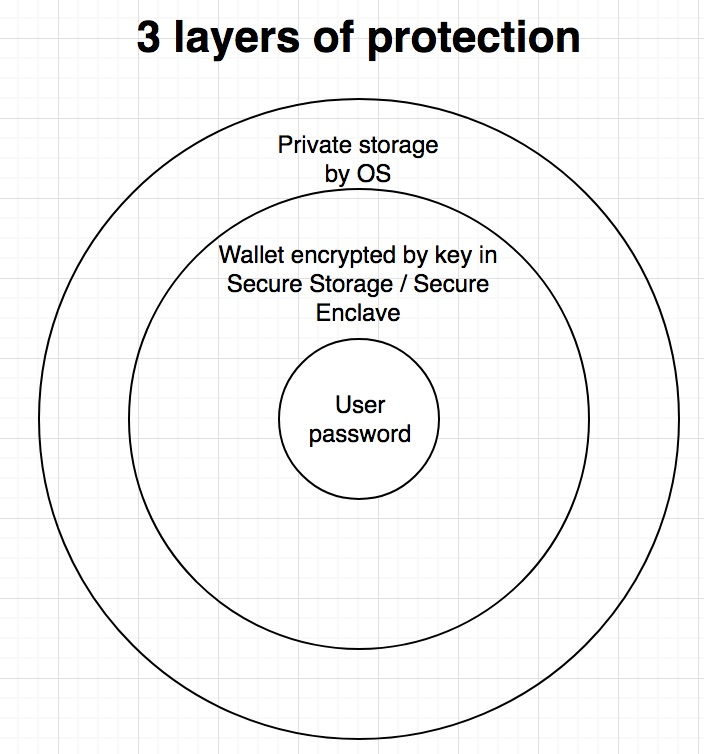
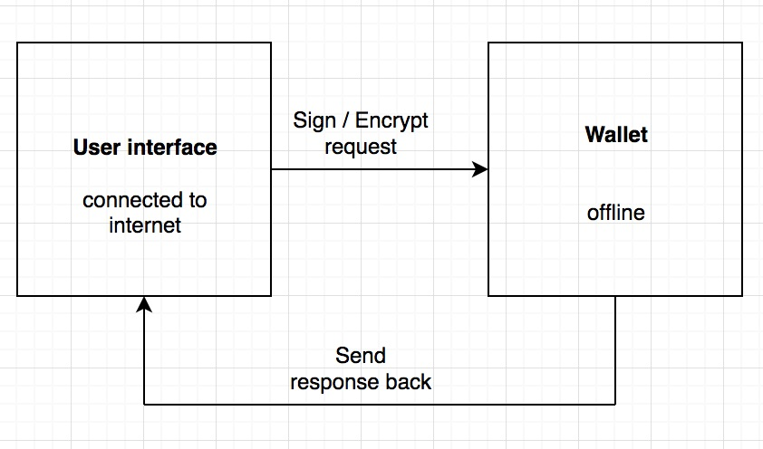

## Tech + Architecture

### Mobile wallet
For security reasons two native apps. React Native, Ionic make compromises to ensure interoperability between OSs. Therefore you can’t use the highest security standards with them. (Security should be the highest priority = brand protection)

KNY: Take picture of ID (DNI, passport…) -> send it to be attested

App consists of two parts

Interaction with Blockchain by libraries (web3j, …)

### Backend

* Language of choice Go. Performance, easy to learn. Focus on simplicity. Official Go implementation written in Go (official library can be used).
* Because of ERC725 the public key of the user is known. All messages sent to the server should be signed and verified.
* Communication with external providers via API
* Rent (virtual) servers (e.g. AWS).
* Security standards (HTTPS, CORS, CSRF, …).

### Blockchain
* Based on Ethereum.
* Solidity is used as programming language for smart contract with SafeMath library to mitigate overflow / underflow attacks.

## Team
* 2 Backend Devs
* 1 Android Dev 
* 1 iOS Devs
* 2 Blockchain Dev
* 1 UX Designer
* 1 Scrum Master
* 1Product Owner

## Culture
* Working with SCRUM in two week sprints. 
* Cross-functional team
*T-shaped (expertise in one field, collaborate across other fields): Collaboration, knowledge exchange is key
*Product Owner is responsible for keeping the team business oriented
 
